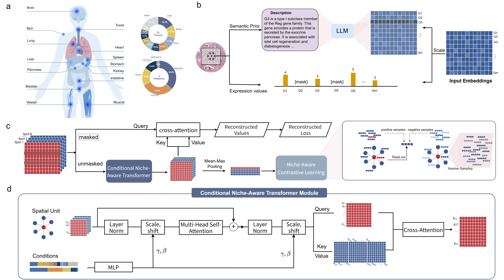

# CoseNiche: Context-aware Spatial Expression Niche Foundation Model

<p align="center">
  
</p>

[](https://www.python.org/downloads/)
[](https://pytorch.org/)
[](https://opensource.org/licenses/MIT)

**CoseNiche** is a foundation model for spatial transcriptomics that leverages spatial neighborhood context to learn robust spot-level representations. It incorporates:

- 🧬 **Gene-level Transformer Encoder** with expression-weighted embeddings
- 🗺️ **Spatial Cross-Attention** for neighborhood context integration
- 🎯 **Platform & Organ Conditioning** via FiLM (Feature-wise Linear Modulation)
- 🔄 **Cross-attention Decoder** for masked expression reconstruction

## Key Features

- **Pre-trained Gene Embeddings**: Leverage pre-trained gene representations for better generalization
- **Multi-hop Spatial Context**: Aggregate information from multi-hop spatial neighbors
- **Flexible Conditioning**: Support for platform, organ, and disease metadata
- **Efficient Inference**: Optimized for extracting spot embeddings at scale

## Installation

```bash
# Clone the repository
git clone https://github.com/yourusername/CoseNiche.git
cd CoseNiche

# Create conda environment
conda create -n coseniche python=3.10
conda activate coseniche

# Install dependencies
pip install -r requirements.txt

# Install CoseNiche
pip install -e .
```

## Quick Start

### 1. Preprocess Data

```bash
python scripts/preprocess.py \
    --h5ad_file /path/to/your/data.h5ad \
    --cache_dir /path/to/cache \
    --max_neighbors 6
```

### 2. Extract Embeddings

```bash
python scripts/extract_embeddings.py \
    --model_path /path/to/model.safetensors \
    --h5ad_path /path/to/your/data.h5ad \
    --cache_dir /path/to/cache \
    --output_dir /path/to/output \
    --device cuda:0
```

### 3. Python API

```python
from coseniche import CoseNicheModel, CoseNicheConfig
from coseniche.data import SpatialDataBank

# Load configuration
config = CoseNicheConfig()
config.inference = True

# Initialize model
model = CoseNicheModel(config)
model.load_pretrained("/path/to/model.safetensors")
model.eval()

# Load data
databank = SpatialDataBank(
    dataset_paths=["data.h5ad"],
    cache_dir="./cache",
    config=config
)

# Extract embeddings
embeddings = model.extract_embeddings(databank)
```

## Model Architecture

```
┌─────────────────────────────────────────────────────────────┐
│                    CoseNiche Architecture                    │
├─────────────────────────────────────────────────────────────┤
│                                                             │
│  Input: Gene IDs + Expression Values + Spatial Coords      │
│         ↓                                                   │
│  ┌─────────────────┐                                        │
│  │ Gene Embedding  │ ← Pre-trained embeddings              │
│  │    + Projection │                                        │
│  └────────┬────────┘                                        │
│           ↓                                                 │
│  ┌─────────────────┐     ┌──────────────────┐              │
│  │ Context Encoder │ ←───┤ FiLM Conditioning │              │
│  │ (6 layers)      │     │ (Platform+Organ)  │              │
│  │ + Spatial Cross │     └──────────────────┘              │
│  │   Attention     │                                        │
│  └────────┬────────┘                                        │
│           ↓                                                 │
│  ┌─────────────────┐                                        │
│  │  CLS Pooling    │ → Spot Embeddings                     │
│  └────────┬────────┘                                        │
│           ↓                                                 │
│  ┌─────────────────┐                                        │
│  │ Cross-Attention │                                        │
│  │    Decoder      │ → Reconstructed Expression            │
│  │  (4 layers)     │                                        │
│  └─────────────────┘                                        │
│                                                             │
└─────────────────────────────────────────────────────────────┘
```

## Data Format

CoseNiche expects AnnData (`.h5ad`) files with:

- `adata.X`: Gene expression matrix (cells × genes)
- `adata.var_names`: Gene symbols
- `adata.obsm['spatial']`: Spatial coordinates (N × 2)
- `adata.obs['platform']` (optional): Sequencing platform
- `adata.obs['organ']` (optional): Tissue/organ type

## Configuration

Key configuration parameters:

| Parameter | Default | Description |
|-----------|---------|-------------|
| `d_model` | 512 | Model embedding dimension |
| `num_heads` | 8 | Number of attention heads |
| `gene_encoder_layers` | 6 | Number of encoder layers |
| `decoder_layers` | 4 | Number of decoder layers |
| `max_seq_len` | 1700 | Maximum sequence length |
| `max_neighbors` | 6 | Maximum spatial neighbors |
| `mask_ratio` | 0.4 | Masking ratio for training |

## Output

The model outputs:

- **`embeddings`**: Spot-level embeddings `[N, d_model]`
- **`reconstructed_expr`**: Reconstructed expression values
- **`attention_scores`**: Encoder and decoder attention weights (optional)

## Downstream Analysis Tutorials

CoseNiche provides comprehensive tutorials for downstream analysis:

### 📊 [Deconvolution Analysis](tutorials/deconvolution/)
Infer cell type composition at each spatial location using CoseNiche embeddings.

**Features**:
- GraphST-style deconvolution with contrastive learning
- Multiple visualization options (stacked bars, pie charts, spatial pies)
- Quantitative reconstruction quality assessment

**Quick start**:
```bash
cd tutorials/deconvolution
python 1_deconvolution.py --config config_pdac.yaml
python 2_plot_composition.py --config config_pdac.yaml
```

### 🧬 [Attention Analysis](tutorials/attention_analysis/)
Analyze self-attention patterns to reveal gene-gene interactions and functional enrichment.

**Features**:
- Domain-level gene interaction networks
- GO/KEGG/Reactome pathway enrichment
- Bubble plots and Sankey diagrams
- Single gene plasticity analysis

**Quick start**:
```bash
cd tutorials/attention_analysis
python 1_export_attention.py --dataset PDAC
python 2_enrichment_analysis.py --dataset PDAC
python 3_bubble_plot.py --dataset PDAC
```

### 💬 [Spatial Communication](tutorials/spatial_communication/)
Study cell-cell communication using spatial attention patterns.

**Features**:
- Spot-to-spot attention flow analysis
- Boundary spot identification
- Ligand-receptor interaction discovery
- Polar plots for directional communication

**Quick start**:
```bash
cd tutorials/spatial_communication
python 1_export_spatial_data.py --dataset PDAC
python 3_prepare_polar.py --layer 5
python 5_plot_polar.py --layer 5
```

### 📖 Documentation

- [Complete Tutorial Guide](tutorials/README.md)
- [Quick Start Guide](tutorials/QUICKSTART.md)
- [Deconvolution Tutorial](tutorials/deconvolution/README.md)
- [Attention Analysis Tutorial](tutorials/attention_analysis/README.md)
- [Spatial Communication Tutorial](tutorials/spatial_communication/README.md)

## Citation

If you use CoseNiche in your research, please cite:

```bibtex
@article{coseniche2024,
  title={CoseNiche: A Foundation Model for Spatial Transcriptomics},
  author={Your Name},
  journal={bioRxiv},
  year={2024}
}
```

## License

This project is licensed under the MIT License - see the [LICENSE](LICENSE) file for details.

## Acknowledgments

- Built with [PyTorch](https://pytorch.org/)
- Data handling with [Scanpy](https://scanpy.readthedocs.io/) and [AnnData](https://anndata.readthedocs.io/)


